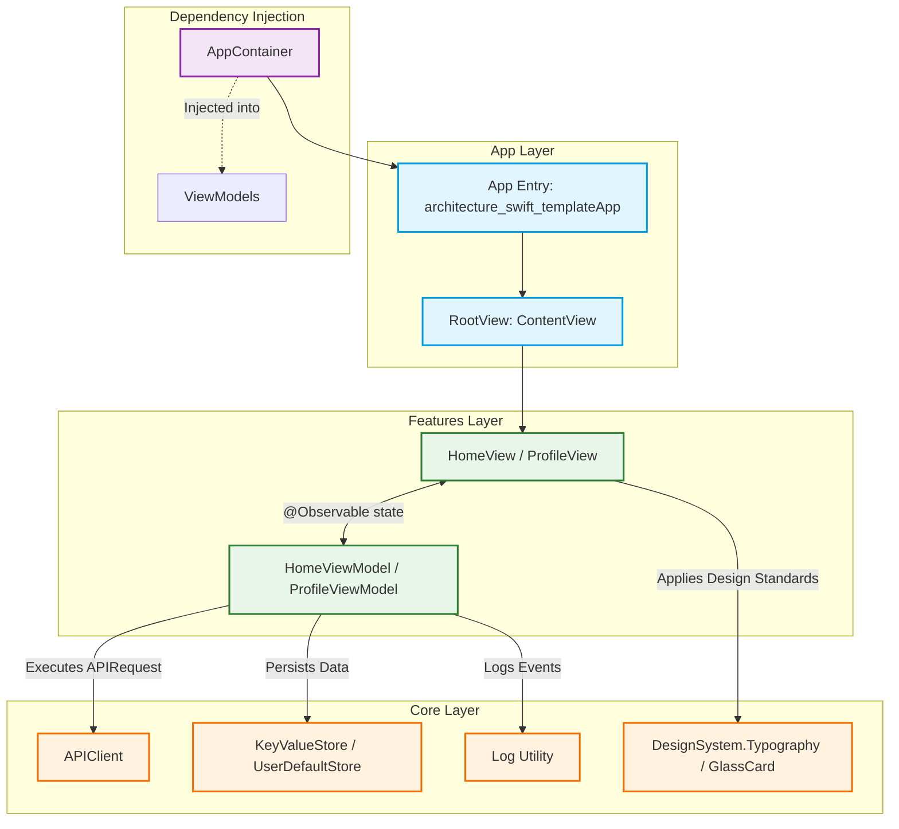

# SwiftUI Clean Architecture Template

A modern, highly-scalable, and lightweight Swift/SwiftUI architecture template designed for iOS apps. This repository implements **MVVM (Model-View-ViewModel)** with **Protocol-Oriented Programming (POP)**, modular boundaries, a central **Dependency Injection (DI) Container**, and dynamic async/await networking.

The `Home` feature ships as a working example: a native-style Weather screen (hero header, hourly scroll, detail grid, Liquid Glass components) backed by the free [Open-Meteo](https://open-meteo.com) API — read it end to end as a reference for how a real feature is wired up.

---

## 🚀 Getting Started

This project uses [XcodeGen](https://github.com/yonaskolb/XcodeGen) to generate the `.xcodeproj` from the declarative `project.yml` spec at the repo root, instead of committing the Xcode project file directly. This keeps project settings diffable in PRs and avoids `.pbxproj` merge conflicts — the `.xcodeproj` itself is gitignored.

```bash
brew install xcodegen
xcodegen generate
open architecture-swift-template.xcodeproj
```

Re-run `xcodegen generate` any time you add, remove, or move Swift files — Xcode won't pick up the change otherwise.

---

## 🏗️ Architecture Blueprint

This template relies on a strict separation of concerns divided into three main layers: `App`, `Core`, and `Features`.



### Folder Structure

```text
architecture-swift-template/
├── project.yml                     # XcodeGen project spec (source of truth for the .xcodeproj)
│
├── App/                             # Application Entry & Window Management
│   ├── architecture_swift_templateApp.swift   # App @main setup & container initialization
│   └── ContentView.swift            # Application Root View / Router
│
├── Core/                            # Shared Foundations & Platform Capabilities
│   ├── DI/                          # Dependency injection graph (AppContainer)
│   ├── Logging/                     # Logging utilities & interfaces
│   ├── Model/                       # Shared DTOs (WeatherResponse, CurrentWeather, HourlyEntry,
│   │                                #   WeatherCondition, WeatherLocation, OpenMeteoDate, EmptyBody)
│   ├── Networking/                  # Network layer (APIClient, APIRequest protocol, Endpoint, APIError)
│   ├── Security/                    # Biometric auth interfaces (BiometricAuthenticating, DeviceBiometricAuthenticator)
│   ├── Service/                     # Concrete requests (GetWeatherForecastRequest)
│   ├── Storage/                     # Storage interfaces (KeyValueStore, UserDefaultStore)
│   └── UI/                          # Design System (DesignSystem.Typography, GlassCard)
│
└── Features/                        # Highly decoupled business domains
    ├── Home/                        # Weather demo feature (UI + state binding)
    │   ├── HomeViewModel.swift      # Screen state management & fetch logic
    │   ├── View/                    # Screens & feature-specific compositions
    │   │   ├── HomeView.swift
    │   │   ├── WeatherHeroView.swift
    │   │   ├── WeatherDetailGrid.swift
    │   │   └── WeatherAttributionSheet.swift
    │   └── UI/                      # Small, reusable, purely-presentational pieces
    │       ├── WeatherDetailTile.swift
    │       ├── HourlyForecastTile.swift
    │       ├── HourlyForecastScroll.swift
    │       └── WeatherBackground.swift
    └── Components/                  # UI component catalog — one screen per native SwiftUI control
        ├── UIComponentDemo.swift    # Catalog enum (title, icon, destination routing)
        ├── FaceIDDemoViewModel.swift  # Only demo with real business logic (LocalAuthentication)
        └── View/                    # ComponentsGalleryView + one *DemoView per component
            # Alert, Action Sheet, Context Menu, Face ID, Keyboard, List, Menus,
            # Picker, Sheets, Slider, Stepper, Tab Bar, Text Fields, Toolbars (Top/Bottom)
```

---

## 🧩 Core Architectural Concepts

### 1. Protocol-Oriented Networking (`APIClient`)
Rather than relying on a monolithic network manager class containing dozens of API-specific functions, networking is entirely **Protocol-Oriented**. Each HTTP request is modeled as a small, isolated `struct` conforming to the `APIRequest` protocol:

```swift
protocol APIRequest {
    associatedtype Response: Decodable
    associatedtype Body: Encodable = EmptyBody

    var method: HTTPMethod { get }
    var endpoint: Endpoint { get }
    var body: Body? { get }
}
```

* **Benefits**: High modularity, zero merge conflicts on network code, and simple mocking of individual requests.
* **`Endpoint`**: A lightweight `path` + `queryItems` pair. `APIClient` combines it with `APIConfig.baseURL` and throws `APIError.invalidURL` if the resulting URL can't be constructed — no force unwraps on the network path.
* **Execution**: The `APIClient` executes requests asynchronously using Swift's native `async/await` syntax:
  ```swift
  let response = try await container.api.execute(GetWeatherForecastRequest())
  ```

### 2. Constructor-Based Dependency Injection (`AppContainer`)
The `AppContainer` serves as the single source of truth for application dependencies:
```swift
final class AppContainer {
    let log: Log.Type
    let store: KeyValueStore
    let api: APIClient

    init(
        log: Log.Type = Log.self,
        store: KeyValueStore = UserDefaultStore(),
        api: APIClient = APIClient()
    ) { ... }
}
```
* **Dependency Flow**: Instantiated exactly once at the app entry point (`architecture_swift_templateApp`), passed down to `ContentView`, and injected into ViewModels upon instantiation.
* **Testability**: Dependencies are protocol-abstracted (e.g., `KeyValueStore`). During testing or SwiftUI Previews, you can inject mock classes or mock containers instantly.

### 3. Local Storage Abstraction (`KeyValueStore`)
Local storage is protected by the `KeyValueStore` protocol:
```swift
protocol KeyValueStore {
    func set(_ value: String, forKey key: String)
    func string(forKey key: String) -> String?
    func set(_ value: Bool, forKey key: String)
    func bool(forKey key: String) -> Bool
    func removeValue(forKey key: String)
}
```
* **Default Store**: Supported by `UserDefaultStore` which wraps `UserDefaults.standard`.
* **Mocking**: Eases the creation of an in-memory mock store for automated testing to prevent tests from writing to actual persistent memory.
* Note: the `Home` feature's Weather demo doesn't currently need persistence, so `store` has no active caller today — it stays in `AppContainer` as an available capability for the next feature that needs it.

### 4. SwiftUI View-ViewModel Architecture (MVVM)
* **Views**: Declarative, purely visual, and react directly to changes in state. They delegate all interactive actions to their ViewModels, and hold them with `@State` — not `@StateObject`.
* **ViewModels**: Marked `@Observable` and `@MainActor`. They capture view actions, execute service code, and expose state via plain `var` properties — no `@Published`, no `Combine` import required.

```swift
import Observation

@Observable
@MainActor
final class HomeViewModel {
    private let container: AppContainer

    var current: CurrentWeather?
    var errorMessage: String?

    init(container: AppContainer) {
        self.container = container
    }

    func fetchWeather() async {
        do {
            current = try await container.api.execute(GetWeatherForecastRequest()).current
        } catch {
            errorMessage = error.localizedDescription
        }
    }
}
```

```swift
struct HomeView: View {
    @State private var viewModel: HomeViewModel

    init(viewModel: HomeViewModel) {
        self.viewModel = viewModel
    }

    var body: some View {
        // ...
        .task {
            await viewModel.fetchWeather()
        }
    }
}
```

---

## 🛠️ Step-by-Step Developer Guide

### 1. How to Add a New Feature
Suppose you want to add a **Profile** feature:

#### Step 1: Create the Feature Folder
Create a new directory: `Features/Profile/`. Following the `Home` feature's convention, if the screen grows past a single simple layout, split it into:
* `View/` — the screen itself and any feature-specific section compositions (anything that owns navigation, presentation, or a particular screen's layout)
* `UI/` — small, reusable, purely-presentational pieces (a tile, a background, a scroll wrapper — anything that just takes data and renders)

#### Step 2: Implement the ViewModel (`ProfileViewModel.swift`)
```swift
import Foundation
import Observation

@Observable
@MainActor
final class ProfileViewModel {
    private let container: AppContainer

    var username: String = "Guest User"
    var isLoading: Bool = false

    init(container: AppContainer) {
        self.container = container
        loadProfile()
    }

    private func loadProfile() {
        username = container.store.string(forKey: "profile_username") ?? "Guest User"
    }

    func updateUsername(_ newName: String) {
        username = newName
        container.store.set(newName, forKey: "profile_username")
        container.log.info("Username updated to \(newName)")
    }
}
```

#### Step 3: Implement the View (`View/ProfileView.swift`)
```swift
import SwiftUI

struct ProfileView: View {
    @State private var viewModel: ProfileViewModel
    @State private var inputName: String = ""

    init(viewModel: ProfileViewModel) {
        self.viewModel = viewModel
    }

    var body: some View {
        VStack(spacing: 20) {
            Text("Welcome, \(viewModel.username)!")
                .typography(.title)

            TextField("Enter your name", text: $inputName)
                .textFieldStyle(.roundedBorder)
                .padding(.horizontal)

            Button("Save Username", action: save)
                .buttonStyle(.glass)
        }
        .padding()
        .navigationTitle("Profile")
    }

    private func save() {
        viewModel.updateUsername(inputName)
    }
}
```

#### Step 4: Hook It Up in Navigation
Prefer `navigationDestination(for:)` over the older `NavigationLink(destination:)` pattern, and never mix the two in the same stack:
```swift
enum Route: Hashable {
    case profile
}

// Registered once on the NavigationStack
.navigationDestination(for: Route.self) { route in
    switch route {
    case .profile:
        ProfileView(viewModel: ProfileViewModel(container: container))
    }
}

// Anywhere inside the stack
NavigationLink("Go to Profile", value: Route.profile)
```

---

### 2. How to Define and Execute a New Network Request
To request data from an endpoint (e.g., fetch a user profile from `https://api.example.com/user`):

#### Step 1: Define the Response DTO (`Core/Model/`)
```swift
struct UserProfileResponse: Decodable, Sendable {
    let id: String
    let name: String
    let email: String
}
```

#### Step 2: Define the Request (`Core/Service/`)
```swift
struct GetUserProfileRequest: APIRequest {
    typealias Response = UserProfileResponse
    typealias Body = EmptyBody // No body is uploaded

    var method: HTTPMethod = .get

    var endpoint = Endpoint(path: "/user")

    var body: EmptyBody? = nil
}
```
`Endpoint` is resolved against `APIConfig.baseURL`, so only the path (and optional `queryItems`) needs to be specified here — not a full URL.

#### Step 3: Execute in your ViewModel
```swift
func fetchUserData() async {
    do {
        let response = try await container.api.execute(GetUserProfileRequest())
        username = response.name
    } catch {
        errorMessage = error.localizedDescription
    }
}
```
Drive it from the view with `.task { await viewModel.fetchUserData() }` rather than spawning a `Task` manually inside the ViewModel — `.task` is cancelled automatically when the view disappears.

---

### 3. SwiftUI Previews & Mocking
To keep SwiftUI Previews robust and offline-capable without polluting production configurations, build a static mock helper:

```swift
extension AppContainer {
    static var mock: AppContainer {
        AppContainer(
            log: Log.self,
            store: MockStore(), // Implement a lightweight KeyValueStore conforming dictionary mock
            api: APIClient()
        )
    }
}

// Inside your SwiftUI View Preview:
#Preview {
    NavigationStack {
        HomeView(viewModel: HomeViewModel(container: .mock))
    }
}
```

---

## 📈 Scalability and Real-World Implementation

When transitioning this template to a complex corporate or enterprise codebase, we recommend scaling using these strategies:

1. **Local Storage Upgrades**: Replace `UserDefaults` inside the storage layer with a robust database (such as SwiftData or CoreData) or secure keychain storage by building concrete implementations conforming to a unified storage protocol contract.
2. **Swift Package Manager (SPM) Modularity**: Scale into multi-target modular architectures by splitting folders (`Core`, `Features/Home`) into separate Swift Packages. This drastically reduces incremental compilation times.
3. **Advanced Coordinator Pattern**: Introduce a router/coordinator layer if screen-to-screen navigation flows become complex, allowing the ViewModel to trigger navigation events through an abstracted delegate interface instead of embedding hardcoded navigation views inside UI code.
4. **XcodeGen Targets**: As the app grows additional targets (widgets, watch app, unit test bundles), add them to `project.yml` rather than configuring them by hand in Xcode — keeps every target's settings reviewable in a PR diff.

---

## 🧼 Code Management and Best Practices

* **View Ownership**: Views should always be dumb. They bind to ViewModels and style labels, nothing more. Avoid putting async blocks, data parsing, or persistent side-effects inside views.
* **ViewModel Observation**: ViewModels use the `@Observable` macro — not `ObservableObject`/`@Published` — and must be annotated `@MainActor` to prevent multi-threaded state update issues on SwiftUI's main loop. Views hold them with `@State`, not `@StateObject`.
* **View/UI Folder Split**: Inside each feature folder, put full screens and feature-specific compositions in `View/`, and small, reusable, purely-presentational pieces in `UI/`. See `Features/Home/` for a worked example.
* **Consistent Design Primitives**: Rely on the shared primitives under `Core/UI/` instead of ad hoc styling.
  * *Typography*: `Text("Text").typography(.title)` or `Text("Text").typography(.body)` — built on Dynamic Type text styles, so it scales correctly with the user's text size setting.
  * *Cards*: `.glassCard()` wraps a view in Apple's Liquid Glass material (`glassEffect(_:in:)`), shaped as a rounded card.
  * *Buttons*: prefer the system's own Liquid Glass styles — `.buttonStyle(.glass)` or `.buttonStyle(.glassProminent)` — over hand-rolled button styles.
* **Dependency Cleanliness**: Never instantiate global shared singletons directly inside features. If a class requires networking, database, or logging capabilities, it *must* receive them through dependencies declared in `AppContainer`.
